# 简单应用笔记

## Springboot
---
### 官网
[官网](https://spring.io/projects/spring-boot)
[一个挺全的总结](https://zhuanlan.zhihu.com/p/362984115)
[如何创建一个springboot项目](https://blog.csdn.net/u011374856/article/details/104533501)

### 特性
1. SpringBoot Starter：他将常用的依赖分组进行了整合，将其合并到一个依赖中，这样就可以一次性添加到项目的Maven或Gradle构建中。
2. 使编码变得简单，SpringBoot采用 JavaConfig的方式对Spring进行配置，并且提供了大量的注解，极大的提高了工作效率，比如@Configuration和@bean注解结合，基于@Configuration完成类扫描，基于@bean注解把返回值注入IOC容器。
3. 自动配置：SpringBoot的自动配置特性利用了Spring对条件化配置的支持，合理地推测应用所需的bean并自动化配置他们。
4. 使部署变得简单，SpringBoot内置了三种Servlet容器，Tomcat，Jetty,undertow.我们只需要一个Java的运行环境就可以跑SpringBoot的项目了，SpringBoot的项目可以打成一个jar包。

### 依赖
pom.xml
```xml
<parent>
    <groupId>org.springframework.boot</groupId>
    <artifactId>spring-boot-starter-parent</artifactId>
    <version>2.5.14</version>
    <relativePath/>
</parent>
```
在目录下创建一个maven子项
子项的pom.xml
```xml
<dependency>
    <groupId>org.springframework.boot</groupId>
    <artifactId>spring-boot-starter-web</artifactId>
</dependency>
```


### 杂项
#### 修改端口
application.properties下
``` js
server.port=8088
```

#### 修改上下文
application.properties下
``` js
server.servlet.context-path=/springboot
```

#### 三层架构及其修饰符
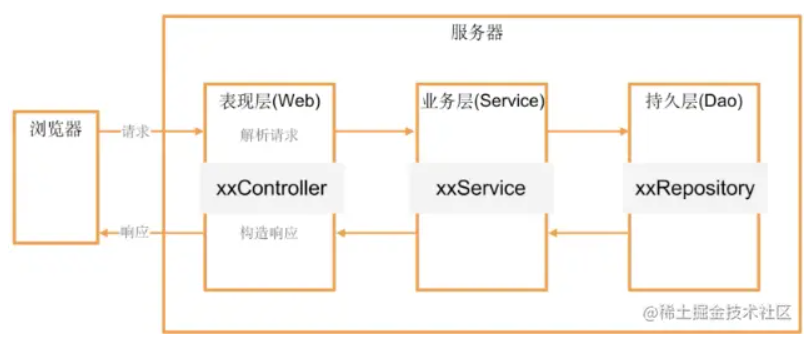
```java
@Controller
@Service
@Repository
```


#### springboot版本错误

因为springboot3.0需要Java17以上的版本
降低springboot版本，改成2.7.12

#### 热部署
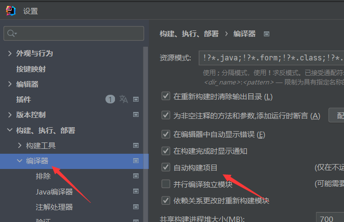
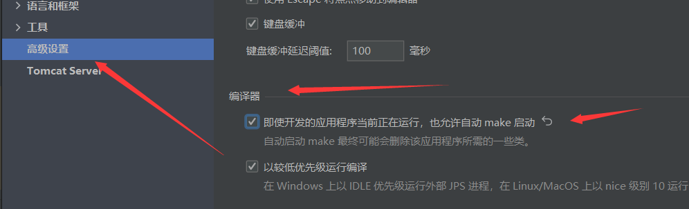
```js
//pom.xml下
<dependency>
			<groupId>org.springframework.boot</groupId>
			<artifactId>spring-boot-devtools</artifactId>
			<optional>true</optional>
		</dependency>
```
```js
//application.properties下
spring.devtools.remote.restart.enabled=true
spring.devtools.restart.additional-paths="src/main/java"
```

## Vue
---
### 官网
[官网链接](https://v2.cn.vuejs.org/v2/guide/)
### 安装
用两行命令 __注意在管理员权限下安装__
安装vue
`npm install vue -g`

安装vue的脚手架使可以通过npm快速创建一个vue项目

`npm install -g @vue/cli`

查看是否安装成功

`vue --version`

###  创建项目
当前目录下cmd输入命令 __注意尽量选择管理员模式有时候会安装依赖__
`vue create 项目名`
选择第三个
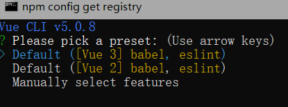
初学者把eslint去掉这个是语句有更强的语法要求，空格取消
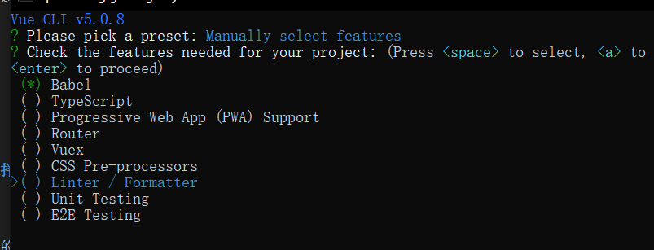
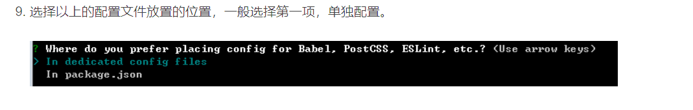
是否要保存配置
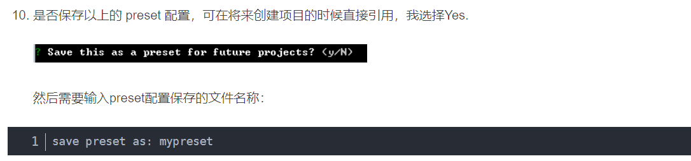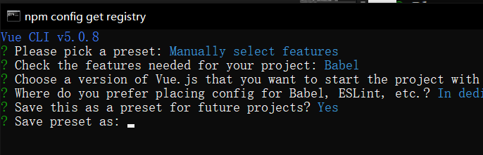
创建完成
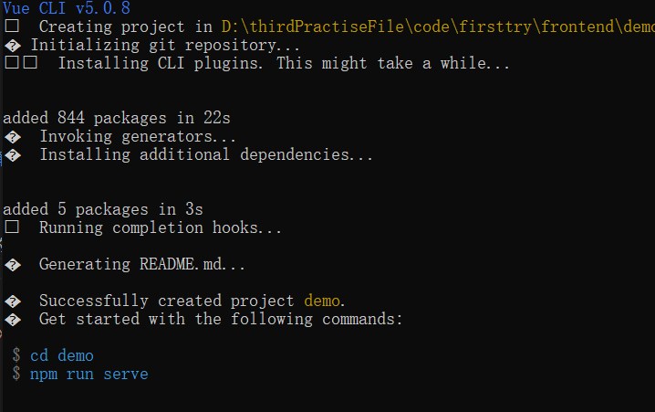
我们可以cd进文件夹
用`npm run serve`启动项目

## Axios
---
### 官网
[官网链接](https://www.axios-http.cn/)
### 安装
语句`npm install axios -g`
### vue全局配置
main.js中
```js
import axios from 'axios'
axios.defaults.baseURL ="http://localhost:8088"
Vue.prototype.$http =axios
```
### 还需要在当前目录下安装axios依赖
`npm install --save axios `

### 跨域问题的解决
#### 跨域问题的解决-后端方法
在后端spring controller里
类前加入`@CrossOrigin`
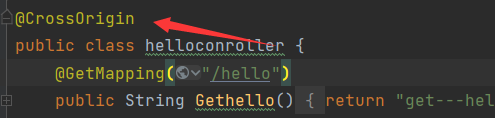

#### 跨域问题的解决-前端方法 ⭐推荐
修改根路径下/vue.config.js
使用代理的方式
```js
module.exports = defineConfig({
  transpileDependencies: true,
  lintOnSave:false, //关闭代码格式化校验工具
    devServer:{
     port: 80 ,//修改启动端口
	  proxy: {
		  // detail: https://localhost
		  //    /api/user/list  /user/list
		  //         http://localhost:8080/user/list
		  '/api': {
			target: `http://localhost:8088/`,
			changeOrigin: true,
			pathRewrite: {
			  '^/api' : ''
			}
		  }
		},
    }
})

```
axios的主机名可以用api
替代如下：
```js
this.$http.get("/api/hello").then(res=>{
          this.info=res.data
          console.log('res',res)})

```
[webpack 配置 changeOrigin 无效的说明](https://blog.csdn.net/qq_39291919/article/details/108807111)
[webpack使用proxy代理时pathRewrite不生效的分析](https://blog.csdn.net/weixin_40920953/article/details/85150784)


### 使用
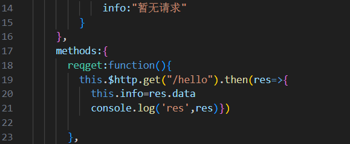
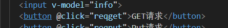
可以用v-bind与事件进行绑定

再通过调用$http来使用，代码：
```js
this.$http.put("/hello").then(res=>{
          this.info=res.data
          console.log('res',res)})
```

## VueRouter
---
### 官网
[官网链接](https://v3.router.vuejs.org/zh/installation.html)

### 安装
vue2:`npm install vue-router@3`
vue3:`npm install vue-router@4`

### main.js配置
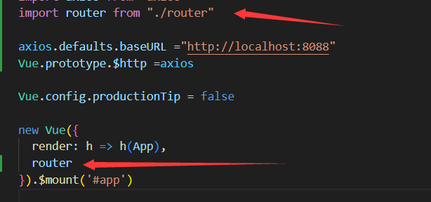
```js
import router from "./router"
```

### index.js
router目录下新建index.js
```js
import Vue from 'vue'
import VueRouter from 'vue-router'
Vue.use(VueRouter)
const router =new VueRouter({
    routes:[
        {path:"/",redirect:"/路径1"},
        {path:"/路径1",component:组件1},//配置对应router切换的组件
        {name:path:"/路径2",component:组件2,//params传参时必须要设置name
            children:[
                {path:"子路径名",component:子组件}]//注意路径不用加斜杠
            },
    ]
})

export default router
```

### 传参方式
params
```js
this.$router.push({
  name:'second',//注意name的设置是必要的
  params: {
    id:'123',
     name: '123'
  }
})
```
query
```js
this.$router.push({
    path:'second',
    query: {
        queryId:'123',
        queryName: '123'
    }
})
```
以上是函数式调用，声明式写在template里的类似

用vue-bind：绑定属性后进行例如：
```js
<router-link :to="{
	name:'list',
	params:{
		info:123,id:this.selected.toString()
	}}">点击这里</router-link>
```

## Mybatis
---
### 依赖
pom.xml依赖
```js
        <dependency>
            <groupId>mysql</groupId>
            <artifactId>mysql-connector-java</artifactId>
            <version>5.1.49</version>
        </dependency>

        <dependency>
            <groupId>org.mybatis</groupId>
            <artifactId>mybatis</artifactId>
            <version>3.5.9</version>
        </dependency>
```

### XML的方式配置应用

#### 从 XML 中构建 SqlSessionFactory
resource 目录下建立xml配置文件
```xml
<?xml version="1.0" encoding="UTF-8" ?>
<!DOCTYPE configuration
  PUBLIC "-//mybatis.org//DTD Config 3.0//EN"
  "https://mybatis.org/dtd/mybatis-3-config.dtd">
<configuration>
  <environments default="development">
    <environment id="development">
      <transactionManager type="JDBC"/>
      <dataSource type="POOLED">
        <property name="driver" value="${driver}"/>
        <property name="url" value="${url}"/>
        <property name="username" value="${username}"/>
        <property name="password" value="${password}"/>
      </dataSource>
    </environment>
  </environments>
  <mappers>
    <mapper resource="org/mybatis/example/BlogMapper.xml"/>
  </mappers>
</configuration>
```
driver填写驱动`com.mysql.jdbc.Driver`
url填写连接链接`jdbc:mysql://localhost:3306/nefu?useSSL=false`
username填写数据库账户
password填写数据库密码

mappers设置xml mapper.xml
对应的mapper.xml下面的路径
#### 映射 SQL 语句
mapper.xml中写sql语句
```xml
<?xml version="1.0" encoding="UTF-8" ?>
<!DOCTYPE mapper
  PUBLIC "-//mybatis.org//DTD Mapper 3.0//EN"
  "https://mybatis.org/dtd/mybatis-3-mapper.dtd">
<mapper namespace="org.mybatis.example.BlogMapper">
  <select id="selectBlog" resultType="Blog">
    select * from Blog where id = #{id}
  </select>
</mapper>
```
mapper namespace 大概是类似于clas类名
select id 大概是对应类下面的方法名
resulType 对应的返回类型，可以写 map

#### 使用
```java
	SqlSessionFactory sqlSessionFactory = null;
        SqlSession session = null;

        String resource = "mybatisconfig.xml";
        InputStream inputStream = Resources.getResourceAsStream(resource);
        sqlSessionFactory = new SqlSessionFactoryBuilder().build(inputStream);

        session = sqlSessionFactory.openSession();

        List<Object> objects = session.selectList("test.selectUser");

        for (Object object : objects) {
            System.out.println(object);
        }
```
大致思路
从mybatisoconfig.xml中获取配置
`SqlSessionFactoryBuilder().build`建立连接
`sqlSessionFactory.openSession()`建立对话
session调用`session.selectList("test.selectUser")`
`test`是mapper namespace的参数
`selectUser`是select id的参数

#### 实例
src/main/resources/mybatisconfig.xml
```xml
<?xml version="1.0" encoding="UTF-8" ?>
<!DOCTYPE configuration
        PUBLIC "-//mybatis.org//DTD Config 3.0//EN"
        "https://mybatis.org/dtd/mybatis-3-config.dtd">
<configuration>
    <environments default="development">
        <environment id="development">
            <transactionManager type="JDBC"/>
            <dataSource type="POOLED">
                <property name="driver" value="com.mysql.jdbc.Driver"/>
                <property name="url" value="jdbc:mysql://localhost:3306/nefu?useSSL=false"/>
                <property name="username" value="root"/>
                <property name="password" value="123456"/>
            </dataSource>
        </environment>
    </environments>
    <mappers>
        <mapper resource="mapper/nefuMapper.xml"/>
    </mappers>
</configuration>
```
src/main/resources/mapper/nefuMapper.xml
```xml
<?xml version="1.0" encoding="UTF-8" ?>
<!DOCTYPE mapper
        PUBLIC "-//mybatis.org//DTD Mapper 3.0//EN"
        "https://mybatis.org/dtd/mybatis-3-mapper.dtd">
<mapper namespace="test">
    <select id="selectUser" resultType="map">
        select * from user
    </select>
</mapper>
```
主函数
```java
package org.example;
import org.apache.ibatis.io.Resources;
import org.apache.ibatis.session.SqlSession;
import org.apache.ibatis.session.SqlSessionFactory;
import org.apache.ibatis.session.SqlSessionFactoryBuilder;
import java.io.IOException;
import java.io.InputStream;
import java.util.List;
public class mybatis {
    public static void main(String[] args) throws IOException {
        SqlSessionFactory sqlSessionFactory = null;
        SqlSession session = null;
        String resource = "mybatisconfig.xml";
        InputStream inputStream = Resources.getResourceAsStream(resource);
        sqlSessionFactory = new SqlSessionFactoryBuilder().build(inputStream);
        session = sqlSessionFactory.openSession();
        List<Object> objects = session.selectList("test.selectUser");
        for (Object object : objects) {
            System.out.println(object);
        }
    }
}
```

### YML的方式配置应用
用这个配置应用时不需要去在程序中导入conf.xml
但其application也只能是yml格式其实和properties没区别
只是格式上有差异,相当于全局配置
properties 和yml可以同时存在
properties优先级高于yml
其中*xml会扫描目录下所有的xml文件
```yml
spring:
  datasource:
    url: jdbc:mysql://localhost:3306/nefu?useSSL=false
    driver-class-name: com.mysql.jdbc.Drive
    username: root
    password: 123456
    hikari:
      connection-test-query: select 1

mybatis:
  mapper-locations: classpath*:mapper/*.xml
```
### 与实体对象的绑定
#### 实体对象的创建
新建一个java类
`alt+insert`或者是右键`生成`
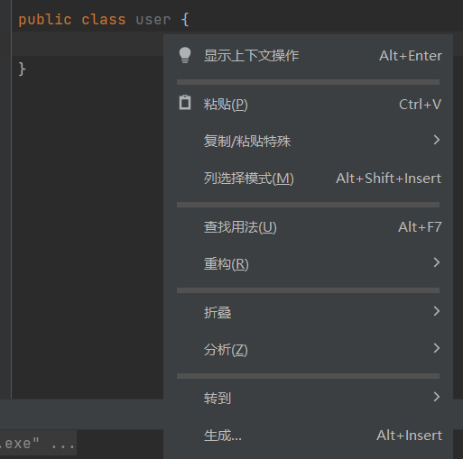
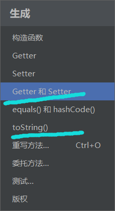
#### 修改mapper.xml
如果实体类型的每一个名字都和数据库里的对应
直接把resultType修改成class类型即可
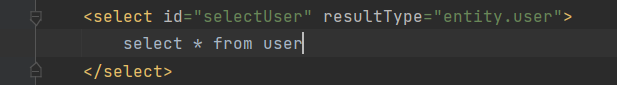
如果实体类型的名字不对应，则需要resultmap来使他一一对应
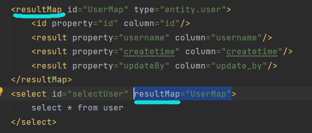

### 增删改查
#### 查一个
java代码
```java
int id=1;
user u = session.selectOne("test.selectUserByID",id);
```
xml代码
```xml
<select id="selectUserByID" resultMap="UserMap" parameterType="int">
        select * from  user where id = #{id}
    </select>
```
#### 插入
java代码
```java
user u = new user();
u.setUsername("wangwu");
u.setPassword("123");
u.setCreatetime(new Date());
u.setUpdateBy("wangwu");
int count = session.update("test.insert",u);
System.out.println("count = " + count);
session.commit();
```
xml代码
```xml
<insert id="insert" parameterType="entity.user" >
        INSERT INTO `nefu`.`user` (
        `username`,
        `password`,
        `createtime`,
        `update_by`
        )
        VALUES
        (
        #{username},
        #{password},
        #{createtime},
        #{updateBy}
        )
    </insert>
```
#### 修改
java代码
```java
int id=3;
user u = session.selectOne("test.selectUserByID",id);
u.setPassword("123333");
int count = session.update("test.updateById",u);
System.out.println("count = " + count);
session.commit();
```
xml代码
```xml
<update id="updateById" parameterType="entity.user">
        UPDATE
        `nefu`.`user`
        SET
        `username` =  #{username},
        `password` =  #{password},
        `createtime` =  #{createtime},
        `update_by` =  #{updateBy}
        WHERE `id` =  #{id}
    </update>
```
#### 删除
java代码
```java
int id=3;
        int count = session.delete("test.deletebyID",id);
        System.out.println("count = " + count);
        session.commit();
```
xml代码
```xml
<delete id="deletebyID" parameterType="int">
        DELETE FROM `user` WHERE `user`.`id` = #{id}
    </delete>
```

### 用接口来实现增删改查 仅需要写xml和接口类
#### xml文件
这里注意`mapper namespace`的参数是接口类的引用
```xml
<?xml version="1.0" encoding="UTF-8" ?>
<!DOCTYPE mapper
        PUBLIC "-//mybatis.org//DTD Mapper 3.0//EN"
        "https://mybatis.org/dtd/mybatis-3-mapper.dtd">
<mapper namespace="sqlctrl.UserMapper">
    <select id="selectUser" resultType="entity.user">
        select * from user
    </select>
</mapper>
```
#### 接口类的实现
函数名对应select的id如果是其他的操作则是其他的id
```java
public interface UserMapper {
    public List<user> selectUser();
}
```

#### 最终调用
重点是`session.getMapper(UserMapper.class)`完成一个mybatis内部的映射关系
```java
UserMapper userMapper = sqlSession.getMapper(UserMapper.class);
```

### sql工具类
通常直接写一个java类来获取session
来简化每次连接获取session会话
```java
package sqlctrl;
import java.io.InputStream;
import org.apache.ibatis.io.Resources;
import org.apache.ibatis.session.SqlSession;
import org.apache.ibatis.session.SqlSessionFactory;
import org.apache.ibatis.session.SqlSessionFactoryBuilder;
public class SqlSessionUtil {
    public static SqlSession getSqlSession() throws Exception{
        String resource = "mybatisconfig.xml";
        //使用类加载器加载mybatis的配置文件（它也加载关联的映射文件）
        InputStream is = Resources.getResourceAsStream(resource);
        //构建sqlSession的工厂
        SqlSessionFactory sessionFactory = new SqlSessionFactoryBuilder().build(is);
        //创建能执行映射文件中sql的sqlSession
        SqlSession sqlSession = sessionFactory.openSession();
        return sqlSession;
    }
}
```
使用
```java
package sqlctrl;
import entity.user;
import org.apache.ibatis.session.SqlSession;
import java.util.List;
public class testmybatis {
    public static void main(String[] args) throws Exception {
        SqlSession sqlSession = SqlSessionUtil.getSqlSession();
        UserMapper userMapper = sqlSession.getMapper(UserMapper.class);
        List<user> users=userMapper.selectUser();
        sqlSession.close();
    }
}
```


### Mybatis的mapper文件中$和#的区别
[Mybatis的mapper文件中$和#的区别](https://www.cnblogs.com/f-zhao/p/6171984.html)


## Mybatis-plus
---
### 参考
[官网](https://baomidou.com/)
[MyBatis-Plus分页插件的使用](https://blog.csdn.net/hbtj_1216/article/details/120390494)
[超全用法](https://blog.csdn.net/q736317048/article/details/110530054)

### 依赖
```xml
<!--        数据库的驱动-->
        <dependency>
            <groupId>mysql</groupId>
            <artifactId>mysql-connector-java</artifactId>
            <scope>runtime</scope>
        </dependency>
        <!--        数据源，自动配置，Hikari-->
        <dependency>
            <groupId>org.springframework.boot</groupId>
            <artifactId>spring-boot-starter-jdbc</artifactId>
        </dependency>

        <!--        Mybaits-plus     跟spring整合的-->
        <dependency>
            <groupId>com.baomidou</groupId>
            <artifactId>mybatis-plus-boot-starter</artifactId>
            <version>3.5.3.1</version>
        </dependency>
```

### 分页的使用
#### 新建配置类
```java
@Configuration
public class MyBatisPlusConfig {

    /**
     * 分页插件配置
     *
     * @return
     */
    @Bean
    public MybatisPlusInterceptor mybatisPlusInterceptor() {
        MybatisPlusInterceptor interceptor = new MybatisPlusInterceptor();
        // 向MyBatis-Plus的过滤器链中添加分页拦截器，需要设置数据库类型（主要用于分页方言）
        interceptor.addInnerInterceptor(new PaginationInnerInterceptor(DbType.MYSQL));
        return interceptor;
    }
}
```
#### controller层的调用
```java
/**
     *  page  current 1
     *        size   10
     *
     *
     *     select * from user  limit 0 ,10
     *
     *   http://127.0.0.1:8080/user/page?current=1&size=2
     *   http://127.0.0.1:8080/user/page?current=2&size=2
     *
     * @param page
     * @return
     */
    @RequestMapping("/page")
    public Page page(Page page){

        return userService.page(page);
    }
```

#### total 显示为0解决
[MyBatis-Plus Page类的total值为0问题解决](https://blog.csdn.net/qq_38974638/article/details/120488839)


## 数据库
---
### 创建
创建数据库

创建表
```sql
CREATE TABLE `nefu`.`user`(  
  `id` BIGINT NOT NULL AUTO_INCREMENT,
  `username` VARCHAR(500) COMMENT '用户名列',
  `password` VARCHAR(500),
  `createtime` DATETIME,
  PRIMARY KEY (`id`)
) ENGINE=INNODB CHARSET=utf8mb4;
```

## JDBC
---
### MySql依赖
```js
        <dependency>
            <groupId>mysql</groupId>
            <artifactId>mysql-connector-java</artifactId>
            <version>5.1.49</version>
        </dependency>
```
### 注册驱动
```js
Class.forName("com.mysql.jdbc.Driver");
Class.forName("com.mysql.cj.jdbc.Driver");
//注意异常处理
```
本质区别：

com.mysql.jdbc.Driver 是 mysql-connector-java 5中的， 
com.mysql.cj.jdbc.Driver 是 mysql-connector-java 6以及以上中的

### 数据库连接
```js
Connection con = DriverManager.getConnection("jdbc:mysql://localhost:3306/数据库名称", "root", "xxx");
```

### 获取数据库对象
```js
Statement stat = con.createStatement();
```

### 执行sql语句
```js
String sql = "xxxx";
ResultSet re=stat.executeQuery(sql);
```

### 关闭连接
`con.close();`

### 结果集获取
 ResultSet：详解
 封装了结果集的对象：内部有一个可移动的光标，默认情况，指向第一条记录集的上一条记录：  
 
 next（）;光标下移动一次：返回的boolean的值;判断是否有结果可以被遍历：  
 previous（）;光标上移动一次： 
 last（）移动到最后一行： 
 afterLast（）;移动到最后一行之后：
 beforeFirst（）移动到第一行的之前：
 first（） 
 
 getObject
 getInt
 getString
 getFloat
 getDouble
 getDate
 getXxx

### 实例
```js
	Class.forName("com.mysql.jdbc.Driver");
        Connection con = DriverManager.getConnection("jdbc:mysql://localhost:3306/nefu?useSSL=false", "root", "123456");
        Statement stat = con.createStatement();
        String sql = "select * from user";
        ResultSet re=stat.executeQuery(sql);
        while(re.next()){
            System.out.println(re.getInt("id")+re.getString("password")+re.getString("password")+re.getTimestamp("createtime"));
        }
        con.close();
```

## Servlet
---
### 依赖
```js
<dependency>
      <groupId>javax.servlet</groupId>
      <artifactId>javax.servlet-api</artifactId>
      <version>3.1.0</version>
    </dependency>
    <dependency>
      <groupId>javax.servlet.jsp</groupId>
      <artifactId>javax.servlet.jsp-api</artifactId>
      <version>2.3.3</version>
    </dependency>

```

## RESTful
### GET
一般用来获取资源（获取记录）
>安全且幂等
获取表示
变更时获取表示（缓存）
>
### POST
一般是用来新增资源(新增记录)
>不安全且不幂等
使用服务端管理的（自动产生）的实例号创建资源
创建子资源
部分更新资源
如果没有被修改，则不过更新资源（乐观锁）
>
### PUT
一般用来更新资源（修改记录）
>不安全但幂等
用客户端管理的实例号创建一个资源
通过替换的方式更新资源
如果未被修改，则更新资源（乐观锁）
>
### DELETE
一般用来删除资源（删除记录）
>不安全但幂等
删除资源
>

## Element杂项
---
### containner全覆盖
```html
<style type="text/css">
/*
	找到html标签、body标签，和挂载的标签
	都给他们统一设置样式
*/
  html,body,#app,.el-container{
        /*设置内部填充为0，几个布局元素之间没有间距*/
        padding: 0px;
         /*外部间距也是如此设置*/
        margin: 0px;
        /*统一设置高度为100%*/
        height: 100%;
    }
</style>
```

### 侧栏全覆盖
```css
.el-menu {
  height: 100vh;
}
```

### router-link去掉下划线
```css
a{
  text-decoration: none;
}
.router-link-active {
  text-decoration: none;
}
```

### NavMenu折叠卡顿
```css
.el-menu-vertical-demo:not(.el-menu--collapse) {
  width: 200px;
  height: 100%;
}
```

### 隐藏侧栏滚动条
```css
.el-aside::-webkit-scrollbar {
     display: none;

}
```

### 弹出确认框
```js
this.$confirm('是否', '提示', {
        confirmButtonText: '确定',
        cancelButtonText: '取消',
        type: 'warning'
      }).then(() => {
        this.$message({
          type: 'success',
          message: '已成功'
        });
      }).catch(() => {
        this.$message({
          type: 'info',
          message: '已取消'
        });
      });
```

## Swagger
---
### 参考
[Spring boot集成Swagger，并配置多个扫描路径](https://www.jianshu.com/p/dcaff30f91cc?tdsourcetag=s_pctim_aiomsg)
### 介绍
可以通过地址访问一个可视化界面，显示接口即作用，可以进行测试，方便前后端对接

springboot2.6以上和Swagger冲突，在 application.properties加上

`spring.mvc.pathmatch.matching-strategy=ant_path_matcher`

### 依赖
```xml
<dependency>
    <groupId>io.springfox</groupId>
    <artifactId>springfox-swagger2</artifactId>
    <version>2.8.0</version>
</dependency>
<dependency>
    <groupId>io.springfox</groupId>
    <artifactId>springfox-swagger-ui</artifactId>
    <version>2.8.0</version>
</dependency>
```
### 配置类
```java
package com.config;
import org.springframework.context.annotation.Bean;
import org.springframework.context.annotation.Configuration;
import springfox.documentation.builders.ApiInfoBuilder;
import springfox.documentation.builders.PathSelectors;
import springfox.documentation.builders.RequestHandlerSelectors;
import springfox.documentation.service.ApiInfo;
import springfox.documentation.spi.DocumentationType;
import springfox.documentation.spring.web.plugins.Docket;
import springfox.documentation.swagger2.annotations.EnableSwagger2;

@Configuration
@EnableSwagger2
public class swaggerconfig {
    /**
     * 创建API应用
     * apiInfo() 增加API相关信息
     * 通过select()函数返回一个ApiSelectorBuilder实例,用来控制哪些接口暴露给Swagger来展现，
     * 本例采用指定扫描的包路径来定义指定要建立API的目录。
     *.apis(RequestHandlerSelectors.basePackage("com.controller"))
     *用来选择需要扫描的包名
     *多个包名参考参考里的链接
     */
    @Bean
    public Docket webApiConfig(){
        return new Docket(DocumentationType.SWAGGER_2).groupName("Api")
                .apiInfo(apiInfo())
                .select()
                .apis(RequestHandlerSelectors.basePackage("com.controller"))
                .paths(PathSelectors.any())
                .build();
    }
    private ApiInfo apiInfo() {
        return new ApiInfoBuilder()
                .title("这是一个标题")
                .description("这是一些描述")
                .version("版本号")
                .build();
    }
}
```


## 项目结构
---
### 前端
#### vue
#### axios
可以对请求进行封装写拦截器
#### router
页面跳转
#### modejs
用于前端数据测试
### 后端
#### mapper层
#### service层
写一些接口再通过接口
再通过实现接口的方法实现
实现接口的时候可以通过extend
mybatis的东西来实现
#### controller
网络的访问获取